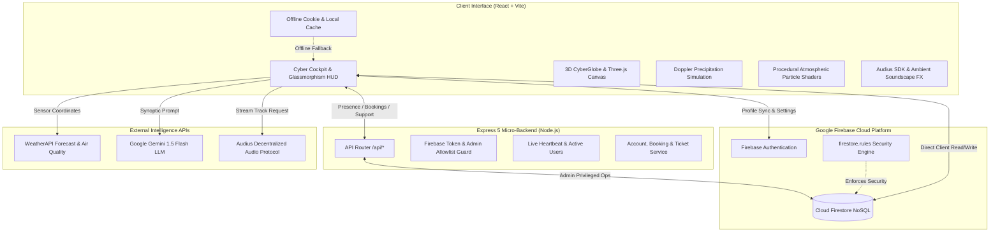

# ⚡ Frostwave Weather (frostwave-wx)
### *Next-Gen Atmospheric Intelligence, 3D CyberGlobe & Earth Expedition Operating System*

[](https://vitejs.dev/)
[](https://react.dev/)
[](https://threejs.org/)
[](https://tailwindcss.com/)
[](https://firebase.google.com/)
[](https://deepmind.google/technologies/gemini/)
[](https://audius.co/)
[](LICENSE)

---

## 🌌 Overview

**Frostwave** is a futuristic, full-stack atmospheric intelligence workstation and geospatial exploration suite. Combining real-time meteorological sensor feeds with an interactive 3D WebGL Earth globe, generative AI atmospheric synthesis, decentralized ambient music streaming, and an enterprise expedition management console, Frostwave transforms standard weather forecasting into an immersive, cyberpunk-inspired operations cockpit.

Built with a modular React architecture, dynamic procedural atmospheric shaders, and a dual-tier backend (Vite frontend + Express 5 API + Firebase Admin & Firestore), Frostwave provides instant global situational awareness for casual travelers, adventurers, and meteorological enthusiasts alike.

---

## ✨ Core Pillars & Key Features

### 🌐 1. Interactive 3D CyberGlobe & Geospatial Radar
- **High-Fidelity 3D Earth Globe**: Powered by **Three.js** and **`react-globe.gl`**, featuring realistic day/night terminator transitions, atmospheric glow layers, and orbital camera controls.
- **Global Flight Corridors & Geodata**: Real-time rendering of international flight corridors, coordinates, global airport hubs, and expedition waypoints (`globeGeodata.js`).
- **Live Doppler Radar Simulation**: Animated meteorological Doppler radar sweeps with multi-layer precipitation density and storm tracking algorithms.
- **City Teleportation Matrix**: Instant sub-second viewport warping to any global capital, expedition site, or user-saved coordinate.

### 🧠 2. Deep Atmospheric Intelligence & AI Synthesis
- **Generative AI Synoptic Briefs**: Integrates **Google Gemini 1.5 Flash** to analyze multi-variable weather vectors (humidity, barometric pressure, wind gusts, UV index, cloud cover) and produce natural-language tactical weather advisories.
- **Precision 3-Day & Hourly Forecasting**: Hour-by-hour meteorological breakdown with dynamic rain probability curves and temperature variance bands via Recharts.
- **Outdoor Planning Suitability Engine**: Multi-factor scoring algorithm balancing precipitation likelihood, wind shear, air quality, and thermal comfort.
- **Celestial & Chrono Tracking**: Real-time solar and lunar azimuth/elevation tracking, golden hour calculations, and dynamic day/night phase rendering.
- **Comprehensive Air Quality Index (AQI)**: Granular analysis of PM2.5, PM10, CO, NO₂, O₃, and SO₂ with health advisories and safety thresholds.

### 🎵 3. Decentralized Weather-Synced Soundscapes
- **Audius Web3 Audio Integration**: Connects to the **Audius Decentralized Streaming Protocol** (`@audius/sdk`) to curate and stream live background music procedurally tailored to current weather conditions (rainy lo-fi, sunny ambient, tempest electronic).
- **Procedural Sound FX & Audio Engine**: Immersive UI sounds (teleport whooshes, atmospheric synthesis, click pulses) and volume-calibrated background soundscapes via the Web Audio API.

### 🗺️ 4. Earth Expedition Suite & Tourism Hub
- **Expedition Discovery & Itinerary Architect**: Curated extreme and eco-tourism itineraries with weather-informed viability ratings.
- **Trip Booking & Offline Voucher Generator**: End-to-end trip reservation workflow, downloadable offline travel passes/vouchers, and party size/budget calculators.
- **Interactive Tourism AI Chat Guide**: Deterministic localized travel concierge and site navigation assistance.
- **Public Share Links**: Authenticated users can generate read-only public shareable itinerary codes (`/api/shared/:shareCode`).

### 🛡️ 5. Enterprise Admin Console & Cloud Backend
- **Live Real-Time Presence Monitoring**: Active heartbeat tracking (`/api/presence`) to observe online users across the globe.
- **User Directory & Credential Management**: Admin ability to search users, create invite credentials with verification links, and soft/hard delete accounts with cascading Firestore cleanup.
- **Support Inbox & Messaging Dispatch**: Private authenticated help-desk ticket thread between users and administrators (`/api/support/me/messages` & `/api/admin/support/*`).
- **Emergency Weather Broadcast System**: System-wide global banners and targeted alerts pushed instantly to user interfaces.
- **Cloud Reminders & Offline Fallbacks**: Synchronized meteorological notifications with local browser cookie fallback for unauthenticated sessions.

### 🎨 6. Next-Gen Cyberpunk & Glassmorphism Design
- **Living Atmosphere Canvas**: Dynamic procedural particle engines generating rain streaks, snow drifts, lightning flashes, fog rolls, and aurora borealis.
- **Customizable Appearance Engine**: Deep obsidian cyber palettes, neon glow accents (`@codaworks/react-glow`), glassmorphic panels, and high-contrast accessibility modes.
- **Typography & Motion**: Styled with **Space Grotesk** modern typography and physics-based micro-interactions powered by **Framer Motion 12**.

---

## 🛠️ Technology Stack

| Layer | Technologies |
| :--- | :--- |
| **Frontend Framework** | [React 18](https://react.dev/), [Vite 6](https://vitejs.dev/), Single Page Architecture |
| **3D & Geospatial** | [Three.js](https://threejs.org/), [react-globe.gl](https://globe.gl/), Procedural HTML5 Canvas Shaders |
| **Styling & Components** | [Tailwind CSS 3](https://tailwindcss.com/), [shadcn/ui](https://ui.shadcn.com/), [Framer Motion](https://www.framer.com/motion), [react-glow](https://github.com/codaworks/react-glow) |
| **Charts & Visuals** | [Recharts](https://recharts.org/), [Weather Icons React](https://erikflowers.github.io/weather-icons/), [Lucide React](https://lucide.dev/) |
| **AI & Intelligence** | [Google Gemini 1.5 Flash API](https://ai.google.dev/), WeatherAPI |
| **Audio Protocol** | [Audius JavaScript SDK](https://audius.co/), Web Audio Synthesizer |
| **Backend API** | [Node.js](https://nodejs.org/), [Express 5](https://expressjs.com/), Axios, Lodash, CORS |
| **Authentication & DB** | [Firebase Authentication](https://firebase.google.com/docs/auth), [Cloud Firestore](https://firebase.google.com/docs/firestore), [Firebase Admin SDK](https://firebase.google.com/docs/admin/setup) |
| **Hosting & CI/CD** | [Vercel](https://vercel.com/) (Frontend SPA), [Render](https://render.com/) (Express API Engine) |

---

## 📐 Architecture & Data Flow



---

## 🚀 Quick Start & Local Setup

### 1. Prerequisites
- **Node.js**: v18.0.0 or higher
- **npm**: v9.0.0 or higher
- **Firebase Account**: (Optional for basic preview; required for Cloud sync, Auth, and Admin console)

### 2. Clone & Install
```sh
# Clone repository
git clone https://github.com/YOUR_USERNAME/frostwave-weather.git

# Navigate to project root
cd frostwave-weather

# Install dependencies
npm install
```

### 3. Environment Configuration
Create a `.env` file in the root directory by copying `.env.example`:

```sh
cp .env.example .env
```

Populate the required environment keys:

```ini
# Weather & AI Intelligence APIs
VITE_WEATHER_KEY="your_weatherapi_key"
VITE_WEATHER_URL="https://api.weatherapi.com/v1/forecast.json"
VITE_SEARCH_URL="https://api.weatherapi.com/v1/search.json"
VITE_GEMINI_KEY="your_gemini_api_key"
VITE_GEMINI_URL="https://generativelanguage.googleapis.com/v1beta/models/gemini-1.5-flash:generateContent"

# Firebase Client Configuration (Firebase Console > Project Settings)
VITE_FIREBASE_API_KEY="your_firebase_api_key"
VITE_FIREBASE_AUTH_DOMAIN="your_project.firebaseapp.com"
VITE_FIREBASE_PROJECT_ID="your_project_id"
VITE_FIREBASE_APP_ID="your_firebase_app_id"
VITE_API_BASE_URL="http://localhost:5000"

# Server-Side Configuration (src/server.cjs)
ADMIN_EMAILS="admin@frostwave.org,lead@frostwave.org"
APP_BASE_URL="http://localhost:5173"
WEB_ORIGINS="http://localhost:5173,http://localhost:5174"
FIREBASE_PROJECT_ID="your_project_id"
# Provide path to Service Account JSON or export GOOGLE_APPLICATION_CREDENTIALS
GOOGLE_APPLICATION_CREDENTIALS="/path/to/service-account.json"
```

### 4. Running the Development Environment
Run the API backend and Vite client concurrently in separate terminals:

```sh
# Terminal 1: Launch Backend API (Port 5000)
npm run dev:api

# Terminal 2: Launch Frontend Development Server (Port 5173)
npm run dev
```

Visit `http://localhost:5173` in your browser.

---

## 🛰️ Deployment Guide

Frostwave is architected for zero-friction modern cloud deployment using **Vercel** for the single-page frontend and **Render** for the Express micro-backend.

```
frostwave-weather/
├── vercel.json     # Single-Page Application routing & rewrite configuration
├── render.yaml     # Render Blueprint for Node.js Express 5 API service
└── firestore.rules # Cloud Firestore granular access security rules
```

### Deploying the Backend API (Render)
1. Fork or push this repository to GitHub.
2. Link your repository in [Render](https://render.com/) and create a **Web Service** using `render.yaml`.
3. Configure the secret environment variables in Render:
   - `FIREBASE_SERVICE_ACCOUNT_JSON`: Paste your Firebase Service Account JSON credentials.
   - `ADMIN_EMAILS`: Comma-separated list of approved admin email addresses.
   - `APP_BASE_URL`: Your deployed frontend domain (e.g., `https://frostwave.vercel.app`).
   - `WEB_ORIGINS`: Allowed CORS origins for the frontend.

### Deploying the Frontend (Vercel)
1. Import the repository in [Vercel](https://vercel.com/).
2. Add the client environment variables (`VITE_WEATHER_KEY`, `VITE_GEMINI_KEY`, `VITE_FIREBASE_*`).
3. Set `VITE_API_BASE_URL` to your Render API URL (e.g., `https://frostwave-api.onrender.com`).
4. Add the Vercel production domain to **Firebase Console → Authentication → Settings → Authorized Domains**.
5. Trigger deploy!

---

## 📡 Backend API Endpoints

| Method | Endpoint | Access | Description |
| :--- | :--- | :--- | :--- |
| `GET` | `/api/health` | Public | System and Firestore connection status |
| `GET` | `/api/trips` | Authenticated | Fetch authenticated user's planned expeditions |
| `POST` | `/api/trips` | Authenticated | Create a new expedition with custom itinerary |
| `GET` | `/api/shared/:shareCode`| Public | Fetch read-only shared itinerary data |
| `POST`| `/api/reminders` | Authenticated | Sync scheduled atmospheric reminders |
| `POST`| `/api/presence` | Authenticated | Active user heartbeat pulse for live telemetry |
| `GET` | `/api/alerts` | Authenticated | Fetch personalized user alerts and broadcasts |
| `GET` | `/api/support/me/messages`| Authenticated | User private support ticket conversation |
| `POST`| `/api/admin/broadcast` | Admin Only | Broadcast emergency meteorological advisory |
| `GET` | `/api/admin/users` | Admin Only | Query registered user accounts and status |
| `GET` | `/api/admin/bookings` | Admin Only | Audit and review expedition booking requests |
| `GET` | `/get-music` | Public | Audius decentralized weather-synced audio feed |

---

## 🔒 Security & Privacy

- **Principle of Least Privilege**: Firebase Admin SDK keys and service account credentials are strictly server-side and never bundled into frontend assets or exposed via `VITE_` variables.
- **Strict Firestore Rules**: All user profile, travel, and settings records are secured via `firestore.rules`, preventing unauthenticated reads and writes across tenant boundaries.
- **Server-Side Admin Role Enforcement**: Administrator privileges are validated against server-side allowlists and verified cryptographically through Firebase ID tokens on every request.

---

## 📄 License

Distributed under the **MIT License**. See [`LICENSE`](LICENSE) for more details.

---

## 👨‍💻 Author & Contributions

Engineered with passion for meteorological science, cyberpunk aesthetics, and spatial computing.
Contributions, issues, and feature suggestions are welcome! Feel free to fork the repository and submit a pull request.